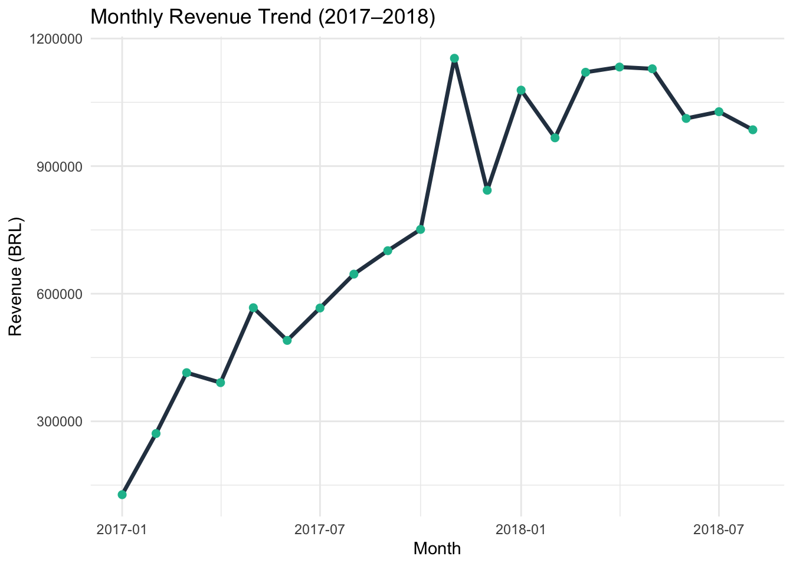
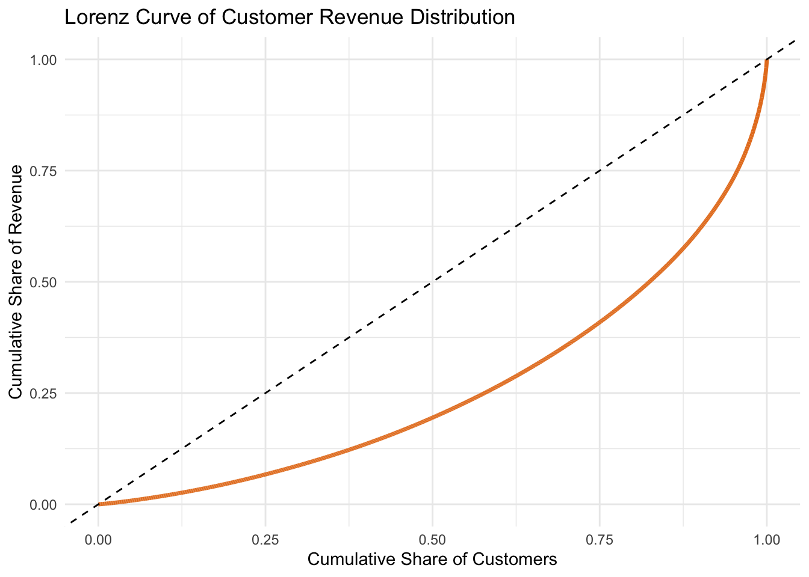

# Marketplace Revenue Risk & Financial Stability Analysis

> Quantifying revenue concentration and cash-flow timing across 99,442 Brazilian marketplace orders (2017–2018) using SQL, R, and HTML/JS.

**Client dashboard prototype:** [Open Dashboard](https://lilwan345.github.io/Marketplace-Revenue-Risk-Financial-Stability-Analysis/dashboard.html)  
**Technical report:** [View Full Interactive Report](https://lilwan345.github.io/Marketplace-Revenue-Risk-Financial-Stability-Analysis/)

---

## What This Project Does

This project builds a financial risk assessment framework on top of the Brazilian E-Commerce Public Dataset (Olist, 2016–2018). It identifies and quantifies four dimensions of revenue risk that matter to marketplace businesses, then packages the results into a client-facing interactive dashboard.

**Why this dataset:** Olist is one of the few publicly available marketplace datasets that combines order-level grain with installment payment data and customer-state metadata. That combination is what allows a multi-dimensional financial risk framework — drop the installment column and the cash-flow timing dimension collapses; drop the state column and the geographic concentration dimension collapses. The framework itself is dataset-agnostic and ports directly to any marketplace with comparable transaction-level data.

| Risk Dimension | Key Metric | Finding |
|---|---|---|
| Revenue Stability | CV = 0.42 (raw); MoM growth volatility = 0.32 (detrended) | Moderate volatility; uneven short-term growth |
| Geographic Concentration | HHI = 0.18 (geographic adaptation) | São Paulo alone drives 37% of total revenue |
| Customer Concentration | Top decile share = 38% (Gini ≈ 0.48) | Top 10% of customers contribute 38% of revenue |
| Cash Flow Timing | Avg. Installments = 4.12; installment-share ≈ 64% | Installment-heavy mix lengthens the working-capital cycle |

> **Note on the CV metric:** Olist was in a ramp-up phase across 2017–2018, so the raw monthly-revenue CV partly reflects the underlying growth trend rather than pure short-term volatility. The detrended MoM growth volatility (0.32) and the CV of trend-removed residuals (0.18) are reported alongside the raw figure in the [technical report](https://lilwan345.github.io/Marketplace-Revenue-Risk-Financial-Stability-Analysis/).

> Bottom line: The data surfaces four observable patterns worth further investigation — revenue volatility around mid-year and post-holiday windows, geographic dependency on São Paulo with MG/PR under-represented vs. their GDP share, revenue concentration in the top customer decile, and cash-flow timing driven by the installment-share of revenue. Each is quantified above and discussed in context in the report.

---

## Dashboard Data Marts

The repository ships eight pre-aggregated CSV data marts under [`data/`](data/). The interactive [`dashboard.html`](dashboard.html) loads them directly in the browser (vanilla JS + SVG), and any analyst can also open them in their BI tool of choice.

| Asset | Purpose |
|---|---|
| [`dashboard.html`](dashboard.html) | Client-facing interactive dashboard prototype for GitHub Pages |
| [`data/monthly_revenue.csv`](data/monthly_revenue.csv) | Monthly revenue trend, MoM growth, and volatility flags |
| [`data/state_revenue.csv`](data/state_revenue.csv) | State-level revenue concentration and ranking |
| [`data/customer_decile_summary.csv`](data/customer_decile_summary.csv) | Revenue concentration by customer decile |
| [`data/customer_lorenz_curve.csv`](data/customer_lorenz_curve.csv) | Lorenz curve points for customer concentration |
| [`data/payment_summary.csv`](data/payment_summary.csv) | One-time vs installment revenue exposure |
| [`data/installment_distribution.csv`](data/installment_distribution.csv) | Revenue distribution by installment count |
| [`data/kpi_summary.csv`](data/kpi_summary.csv) | Executive KPI cards with client-friendly explanations |
| [`data/action_plan.csv`](data/action_plan.csv) | Suggested action areas and tracking metrics |

## Key Findings

| Monthly Revenue Trend (2017–2018) | Customer Revenue Distribution (Lorenz) |
|---|---|
|  |  |

*Left: the ramp-up trend that inflates the raw CV (0.42) and motivates reporting a detrended companion (MoM growth volatility 0.32). Right: the Lorenz curve underlying the Gini of 0.48 — the bow away from the diagonal is the customer-concentration signal.*

- **Revenue is volatile short-term**: CV of 0.42 and uneven month-over-month growth indicate unstable performance, despite an overall upward trend from 2017 to 2018.
- **São Paulo dominates geographically**: SP contributes ~37% of revenue, followed by RJ (~13%) and MG (~12%). HHI on state-level revenue shares lands at 0.18, signalling meaningful but non-extreme concentration. (HHI is adapted here from its antitrust convention, where it scores firm market shares; the antitrust interpretive bands are not directly transferable to geographic revenue shares, so the value is reported descriptively rather than benchmarked against a regulatory threshold.)
- **A small customer base drives most revenue**: The top decile alone accounts for 38% of revenue; the top three deciles contribute ~64%. The Lorenz curve and Gini coefficient (0.48) confirm high revenue inequality.
- **Installment payment mix lengthens the working-capital cycle**: ~64% of revenue comes from installment orders, with a revenue-weighted average of 4.12 installments per order. The 4.12 figure is modest within Brazil's "12x sem juros" cultural baseline; the dominant cash-timing signal is the installment-share of revenue, not the per-order installment depth.

---

## Tools & Methods

**SQL (PostgreSQL)**
- Constructed modular views for financial orders, state revenue, customer deciles, and payment structure
- Applied window functions (NTILE, SUM OVER) for segmentation and ranking

**R (RMarkdown)**
- Computed four non-overlapping risk metrics so each maps to a distinct dimension of marketplace revenue risk: CV for revenue stability, HHI (geographic adaptation) for state-level concentration, Gini for customer-level concentration, and revenue-weighted installment count for cash-flow timing
- Reported a detrended companion to the raw CV (MoM growth volatility, residual CV after linear detrending) so the headline volatility figure is not inflated by the 2017–2018 ramp-up trend
- Visualized trends with ggplot2: line charts, bar charts, and Lorenz curve

**HTML/JS dashboard prototype**
- Exported KPI, trend, concentration, cash-flow timing, and action-plan datasets as standalone CSVs under `data/`
- Built `dashboard.html` directly (vanilla JS + SVG), so reviewers can interact with the deliverable without installing any BI tool

---

## Project Structure

```
├── Analysis.Rmd          # Main analysis (R Markdown source)
├── index.html            # Rendered GitHub Pages report
├── dashboard.html        # Client-facing dashboard prototype
├── project.sql           # SQL views for data preparation
├── data/                 # Pre-aggregated CSV data marts (dashboard data source)
│   ├── kpi_summary.csv
│   ├── monthly_revenue.csv
│   ├── state_revenue.csv
│   ├── customer_decile_summary.csv
│   ├── customer_lorenz_curve.csv
│   ├── payment_summary.csv
│   ├── installment_distribution.csv
│   └── action_plan.csv
└── assets/                # README chart exports
```

> The three raw Olist source files (`olist_orders_dataset.csv`, `olist_customers_dataset.csv`, `olist_order_payments_dataset.csv`) are intentionally not tracked in git — they come from the public Kaggle dataset (see [Data Source](#data-source)). Download them once into the repo root and the analysis runs from there.

---

## How to Reproduce

**Step 0 — download the raw Olist files (one-time):**

The raw `olist_orders_dataset.csv`, `olist_customers_dataset.csv`, and `olist_order_payments_dataset.csv` files are not tracked in this repo. Download them from the [Kaggle dataset page](https://www.kaggle.com/datasets/olistbr/brazilian-ecommerce) and place all three in the repository root.

The pre-aggregated data marts under [`data/`](data/) are committed to the repository, so the dashboard runs as-is with no database setup. To regenerate the underlying analysis from raw data, follow the full path below.

**Full path — regenerate the technical report (PostgreSQL required):**

1. Import the three raw CSVs into PostgreSQL as tables named `olist_orders_dataset`, `olist_customers_dataset`, and `olist_order_payments_dataset`.
2. Run [`project.sql`](project.sql) against that database to create the analytical views (`financial_orders`, `state_revenue`, `customer_revenue`, `customer_revenue_decile`, `order_payment_structure`, `monthly_revenue`).
3. Configure the database connection. The R chunk in [`Analysis.Rmd`](Analysis.Rmd) reads connection parameters from environment variables, with the author's local defaults as fallbacks:

   | Variable | Default | Purpose |
   |---|---|---|
   | `OLIST_DB_NAME` | `leowan34` | PostgreSQL database name |
   | `OLIST_DB_HOST` | `localhost` | PostgreSQL host |
   | `OLIST_DB_PORT` | `5332` | PostgreSQL port |
   | `OLIST_DB_USER` | `leowan34` | PostgreSQL user |
   | `PG_PASSWORD` | (required) | PostgreSQL password |

4. Render the report:

   ```r
   Rscript -e 'rmarkdown::render("Analysis.Rmd", output_file = "index.html")'
   ```

R package dependencies are listed at the top of [`Analysis.Rmd`](Analysis.Rmd): `DBI`, `RPostgres`, `ggplot2`, `dplyr`, `ineq`.

---

## Data Source

[Brazilian E-Commerce Public Dataset by Olist](https://www.kaggle.com/datasets/olistbr/brazilian-ecommerce) — 99,442 orders from September 2016 to August 2018, covering order details, customer locations, and payment structures.

> **Analysis window:** The raw dataset spans September 2016 to August 2018, but late-2016 contains only a partial month of activity. The analysis filters to orders with `order_purchase_timestamp >= 2017-01-01` so the monthly-revenue series, CV, and MoM growth volatility are measured on full months only. Headline figures throughout the report reference the 2017–2018 analysis window.

> **Note:** Findings are specific to this time period and market context; some metrics (e.g. average installment count) should be read against the local "12x sem juros" baseline rather than U.S. benchmarks. The framework itself is portable to other marketplaces with comparable transaction-level data.

---

## Author

**Liyuan Wan** · [GitHub](https://github.com/lilwan345)
